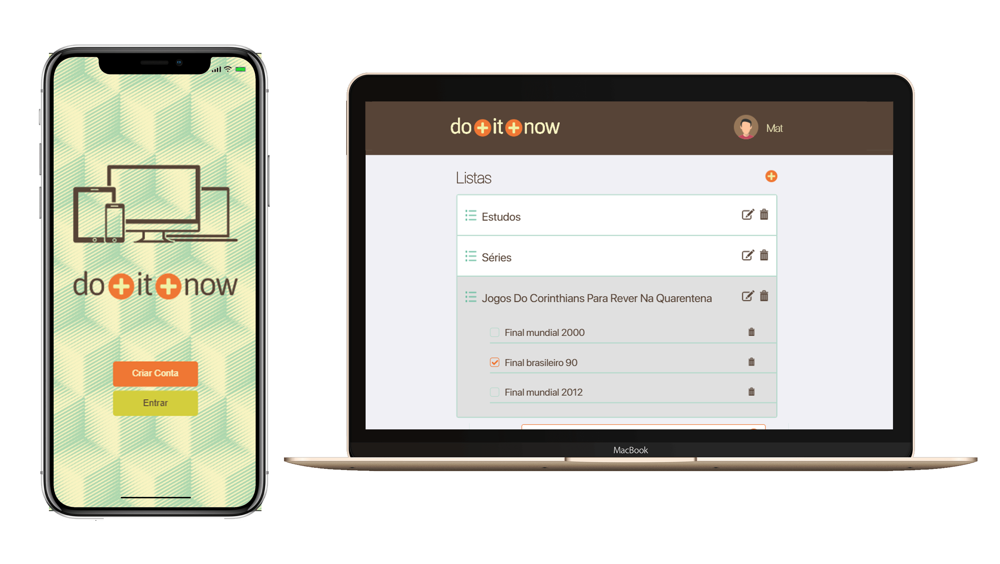

<h1 align="center">
    
</h1>
<h4 align="center">
       ✏️ Do it now! 📑
</h4>

  <a href="#rocket-tecnologias">Tecnologias</a>&nbsp;&nbsp;&nbsp;|&nbsp;&nbsp;&nbsp;
  <a href="#-projeto">Projeto</a>&nbsp;&nbsp;&nbsp;|&nbsp;&nbsp;&nbsp;
  <a href="#-principais-conceitos-abordados">Conceitos</a>&nbsp;&nbsp;&nbsp;|&nbsp;&nbsp;&nbsp;
  <a href="#-configuração-do-projeto">Configurações</a>&nbsp;&nbsp;&nbsp;|&nbsp;&nbsp;&nbsp;

 

<h1 align="center">
    
</h1>

## :rocket: Tecnologias

- [ReactJS](https://reactjs.org)
- [Redux](https://redux.js.org/)
- [Yup](https://github.com/jquense/yup)
- [Formik](https://formik.org/docs/overview)
- [Styled Component](https://styled-components.com/)

## 💻 Projeto

Aplicação proposta e desenvolvida como desafio do processo seletivo da [AutoSeg](https://www.autoseg.com/). Trata-se de um todo app utilizando ReactJS e Redux como principais tecnologias :)

## 📚 Principais conceitos abordados e aprendidos

- Validação de formulários utilizando bibliotecas como yup e formik
- Uso de Redux para criação de um state global
- Manipulação do state de acordo com actions
- Persistindo store com [redux persist](https://github.com/rt2zz/redux-persist)

## 🤔 Configuração do projeto

- Clone o repositório
- Entre no path do projeto
- Exceute um _yarn/npm install_ para instalar as dependências necessárias
- Execute 'npm start' ou 'yarn start' no terminal

  **Ou clique no link abaixo se deseja apenas visualizar a aplicação :smile:**

# :point_down:**Link da aplicação hospedada** :point_down:

## https://autosegtodoapp.herokuapp.com/
